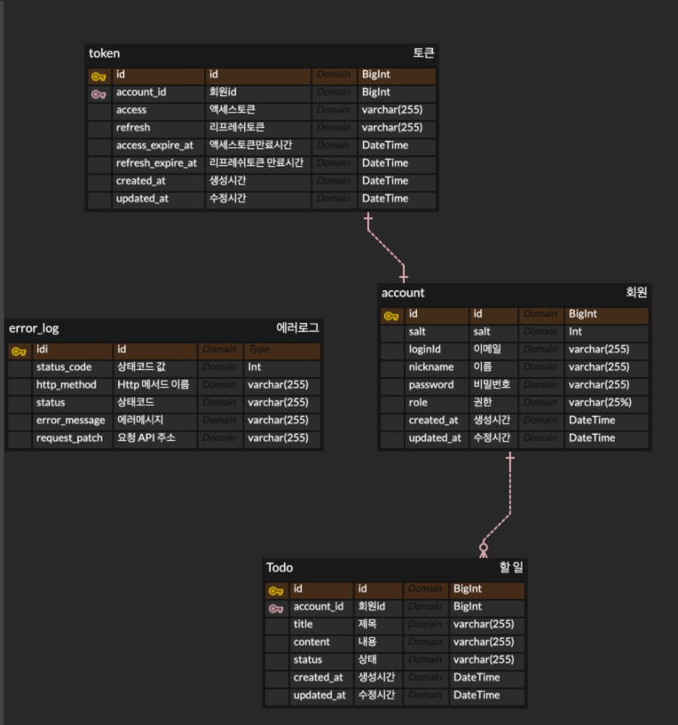

# ERD




# 기능 목록
- 회원가입
- 로그인
- 회원 탈퇴
- Todo 생성
- Todo 조회

# API 명세서

### 회원가입
POST /api/accounts

Request Body

```json
{
  "loginId": "로그인아이디",
  "nickname": "닉네임",
  "password": "비밀번호"
}
```
- 중복된 로그인 아이디가 존재 할 경우 예외 발생한다.
- 중복된 닉네임이 존재하는 경우 예외가 발생한다.

### 로그인
POST /api/accounts/login

Request Body

```json
{
  "loginId": "로그인 아이디",
  "password": "비밀번호"
}
```
- 아이디 또는 비밀번호를 틀리면 예외가 발생한다.

Response Body

```json
{
  "code": 상태코드값,
  "status": "상태코드",
  "data": {
    "id": 회원Id,
    "grantType": "Bearer",
    "accessToken": "액세스 토큰 값",
    "accessTokenExpireAt": "액세스 토큰 만료시간",
    "refreshToken": "리프레쉬 토큰 값",
    "refreshTokenExpireAt": "리프레쉬 토큰 만료시간"
  }
}
```

### 회원 탈퇴
DELETE /api/accounts

Authorization: Bearer {엑세스 토큰 값}

- 탈퇴 하려는 회원이 존재하지 않을 경우 예외가 발생한다.


### Todo 생성

POST /api/todo

Authorization: Bearer {액세스 토큰 값}

```json
{
  "title": "제목",
  "content": "내용"
}
```

### Todo 조회

GET /api/todo?type=

Parameter

name : type

value : RECENT 또는 ALL

Authorization: Bearer {액세스 토큰 값}

### TODO 상태 변경

PUT /api/todo/{todoId}

PathVariable : todoId

Authorization: Bearer {액세스 토큰 값}

```json
{
  "status" : "TODO" // TODO, IN_PROGRESS,DONE, PENDING;
}
```

# 고민했던 부분

## 1. Todo 조회 API
가장 최근 Todo와 전체 Todo를 조회를 해야 하는데 API를 어떻게 설계를 해야 할지 고민을 하였습니다.
고민을 한 이유는 가장 최근 Todo는 단건, 전체 Todo 조회는 여러 건이라 고민을 했습니다.
단건 같은 경우에는 응답값을 List 형태가 아닌 하나의 객체 형태로 응답을 해야 된다고 생각을 하였고
전체 Todo 조회는 List로 응답을 해야 된다고 생각을 하였습니다.
그래서 고민을 하다가 내린 결정은 모두 List의 형태로 응답을 하고 요청 type으로 구분하는 것으로 결정하였습니다.

## 2. POST 요청과 PUT 요청에 대한 응답 값 여부
고민을 했던 이유 Get 요청은 Post와 Put과 달리 클라이언트가 서버에 리소스에 대한 정보를 요청을 하여 응답 값을 서버에서 내려주는 게 맞는다고 생각을 하였습니다.
그러나 Post와 Put 같은 경우는 클라이언트가 리소스를 생성 또는 수정을 할 때 서버에 요청을 하는 것이기 때문에 응답 값이 불필요합니다.
그래서 이러한 정의로 인해서 고민을 했던 부분은 POST 또는 PUT 요청에 대한 응답 값을 클라이언트에게 응답을 해주면 프런트 입장에서는 서버에서 보내준 응답 값으로 화면에 보여주기 때문에 불필요하게 조회 API를 호출하지 않고 사용자에게 서비스를 제공할 수 있습니다.
고민한 결과 이번 과제에서는 클라이언트에게 제공해야 될 정보가 존재할 경우에는 POST 요청이라 하더라도 응답 값을 클라이언트에게 응답을 해주고 그렇지 않으면 상태 코드만 응답해 주는 방식으로 결정했습니다.

## 3. 고려한 사항
계층 간 결합도를 낮추기 위해 클라이언트로부터 들어오는 요청 DTO를 분리하여 비즈니스 계층에 전달을 하여 프레젠테이션 계층과의 결합도를 낮추었습니다.
